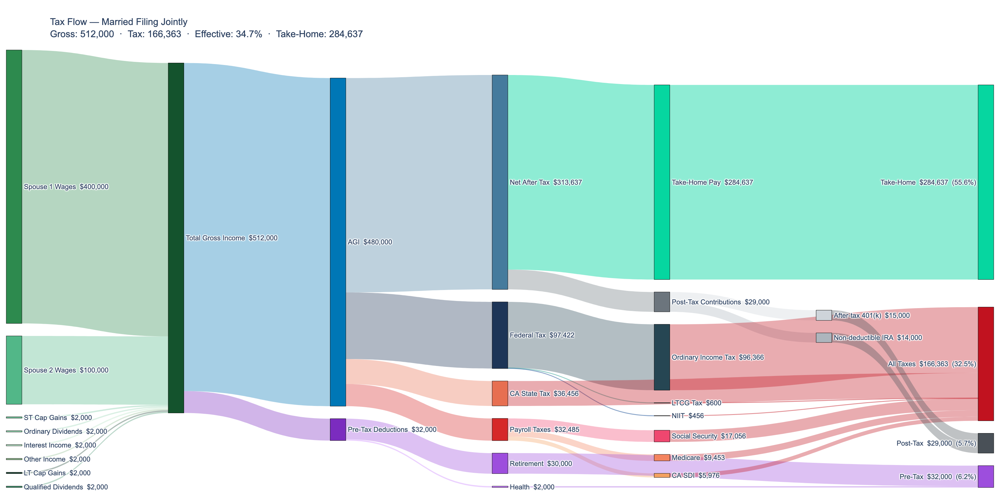
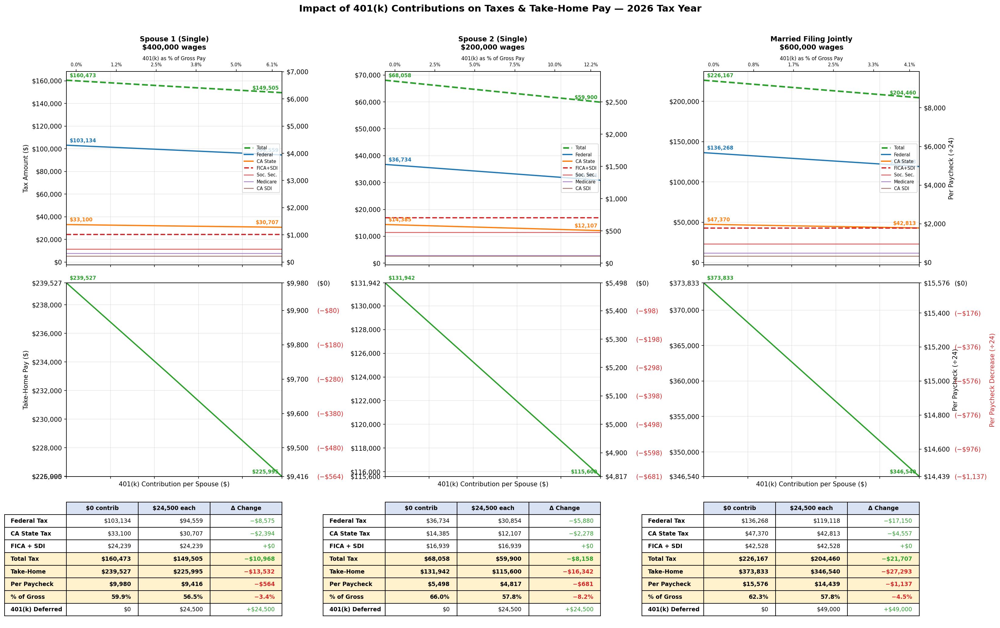

# Tax Calculator

A Python-based tax calculator for Federal income tax, California state income tax, and payroll taxes.

Covers federal ordinary income tax, long-term capital gains / qualified dividend tax, Net Investment Income Tax (NIIT), California income tax (including the Mental Health Services surcharge), Social Security, Medicare, Additional Medicare, and California SDI/VDI.

Takes wages, investment income (capital gains, dividends, interest), pre-tax deductions (401k, HSA, FSA), and post-tax contributions as inputs. Produces a detailed breakdown of each tax with per-bracket amounts, effective and marginal tax rates, and final take-home pay.

Also generates a Sankey diagram visualizing how gross income flows into each tax category, deductions, and net pay.

## Supported Features

- All filing statuses: Single, Married Filing Jointly, Married Filing Separately, Head of Household
- Federal ordinary income tax and preferential rates for LTCG/qualified dividends (stacked bracket method)
- California income tax including Mental Health Services surcharge (Prop 63)
- Social Security, Medicare, and Additional Medicare taxes
- FICA-aware pre-tax deductions — correctly distinguishes retirement (401k/403b/457b) from Section 125 (health/FSA/HSA) and Section 132(f) deductions
- Net Investment Income Tax (NIIT)
- California SDI and voluntary VDI plans
- Investment income with Schedule D capital gains netting (ST/LT losses, $3,000/$1,500 deduction cap, carryforward tracking)
- Per-bracket breakdowns, W-2 wage reconciliation, effective and marginal tax rates
- Sankey diagram visualization of income flow

See [requirements.md](requirements.md) for the full specification — inputs, calculation formulas, tax rules, output format, and UX behavior.

## Supported Tax Years

| Year | Data Module |
|------|-------------|
| 2024 | `tax_data_2024.py` |
| 2025 | `tax_data_2025.py` |
| 2026 | `tax_data_2026.py` |

## Quick Start

**Prerequisites:** Python 3.10+

```bash
pip install -r requirements.txt
```

### Interactive Mode

The main way to use the calculator. Walks you through every input step by step — filing status, wages, investment income, deductions, and contributions — then prints the full tax breakdown and generates a Sankey diagram.

```bash
python main.py
```

### Scripted Mode

Useful when you want to re-run the calculator quickly with the same inputs, or compare scenarios without re-entering everything each time. Edit the input values at the top of `run.py`, then run it — inputs are fed into `main.py` automatically.

```bash
python run.py
```

### Output

The calculator prints a detailed report covering:

- Income breakdown (wages, capital gains netting, ordinary vs. preferential income)
- W-2 taxable wage reconciliation (Box 1, 3, 5, 16)
- AGI and standard deductions (federal and California)
- Federal tax: per-bracket ordinary tax, LTCG/qualified dividend tax, NIIT
- California tax: per-bracket breakdown including Mental Health surcharge
- Payroll taxes: Social Security (per-spouse caps for MFJ), Medicare, Additional Medicare, CA SDI/VDI
- Tax summary with effective and marginal rates
- Take-home pay after all taxes, deductions, and contributions

A **Sankey diagram** is automatically generated after each run, showing how gross income flows into federal tax, state tax, payroll taxes, deductions, contributions, and take-home pay.


***Figure:** Sankey diagram showing income flow for a Married Filing Jointly scenario*

### Generate Tax Tables

Produces a markdown file showing combined marginal tax rates (federal + California + FICA) at every bracket boundary across a range of income levels. Helpful for understanding how your marginal rate changes as income grows.

> **Note:** Change the `import tax_data_2026 as td` line at the top of `gen_tax_table.py` to target a different tax year.

```bash
python gen_tax_table.py
```

### Plot 401(k) Impact

Helps you decide how much to contribute to your 401(k) by showing the trade-off between tax savings and take-home pay at every contribution level. See exactly how each additional dollar contributed reduces your taxes, how much less take-home pay you get in return, and where the diminishing returns kick in.

> **Note:** Edit the `CONFIGURATION` section at the top of `plot_401k_couple_comparison.py` to set spouse wages and the tax data module.

```bash
python plot_401k_couple_comparison.py
```


***Figure:** 401(k) contribution impact on taxes and take-home pay — Single vs. Married Filing Jointly*

## Project Structure

### Tax Calculator (`main.py`)

The core application — run interactively or via the scripted runner.

| File | Purpose |
|------|---------|
| `main.py` | Entry point — collects inputs, runs calculator, displays results, generates Sankey |
| `calculator.py` | Tax engine — all tax computations |
| `prompts.py` | Interactive CLI input collection and result display |
| `plot_sankey.py` | Sankey diagram generation (Plotly) |
| `constants.py` | Shared constants (filing statuses, capital loss limits) |
| `tax_data_2024.py` | 2024 brackets, deductions, thresholds |
| `tax_data_2025.py` | 2025 brackets, deductions, thresholds |
| `tax_data_2026.py` | 2026 brackets, deductions, thresholds |

### Scripted Runner

| File | Purpose |
|------|---------|
| `run.py` | Feeds predefined inputs into `main.py` — edit values at the top and run without interactive prompts |

### Standalone Scripts

Independent of the main calculator; import `calculator.py` and tax data directly.

| File | Purpose |
|------|---------|
| `gen_tax_table.py` | Generates combined marginal tax rate tables across a range of income levels (see [2025 table](tax_table_2025.md), [2026 table](tax_table_2026.md)) |
| `plot_401k_couple_comparison.py` | Plots the impact of 401(k) contributions on taxes and take-home pay for a couple (Single vs. MFJ) |

### Documentation

| File | Description |
|------|-------------|
| [how-taxes-work.md](how-taxes-work.md) | Step-by-step walkthrough of how federal and California taxes are calculated |
| [federal-tax-rates-2025.md](federal-tax-rates-2025.md) | Federal bracket tables by filing status |
| [california-tax-rates-2025.md](california-tax-rates-2025.md) | California bracket tables by filing status |
| [pre-tax-deductions.md](pre-tax-deductions.md) | Retirement, health, and other pre-tax deduction limits |
| [requirements.md](requirements.md) | Full specification of all inputs, calculations, and output format |

## Tax Coverage

| Tax | Rate(s) | Notes |
|-----|---------|-------|
| Federal ordinary income | 10–37% | Progressive brackets |
| Federal LTCG / qualified dividends | 0%, 15%, 20% | Stacked on top of ordinary income |
| Net Investment Income Tax (NIIT) | 3.8% | AGI above $200k/$250k threshold |
| California income | 1–13.3% | All income taxed as ordinary; includes 1% Mental Health surcharge above $1M |
| Social Security | 6.2% | Up to wage base ($176,100 in 2025), per-spouse for MFJ |
| Medicare | 1.45% | On all wages |
| Additional Medicare | 0.9% | On wages above $200k/$250k threshold |
| CA SDI | 1.2% | On all wages (no cap); VDI alternative supported |

## Dependencies

- [NumPy](https://numpy.org/) — numerical operations for tax table generation and plotting
- [Matplotlib](https://matplotlib.org/) — 401(k) impact comparison charts
- [Plotly](https://plotly.com/python/) — Sankey diagram generation
- [Kaleido](https://github.com/plotly/Kaleido) — static image export for Plotly charts
